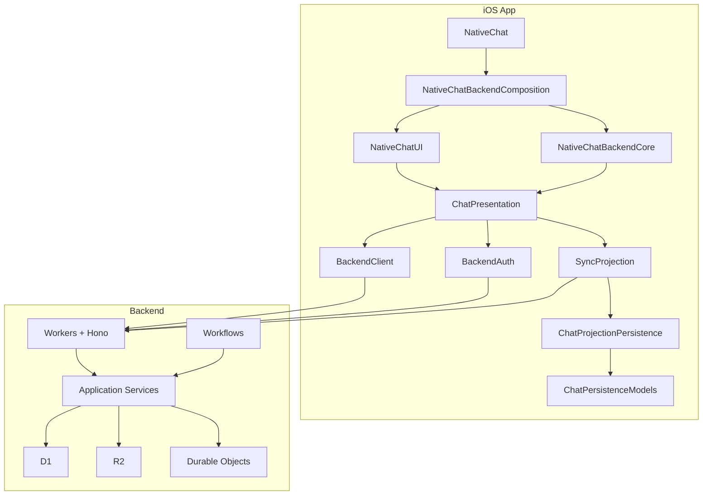

# GlassGPT

[](https://swift.org)
[](https://developer.apple.com)
[](LICENSE)
[](#testing)

GlassGPT is a native iOS and iPadOS chat client on the `5.3.0` hardening line.
The app is written in Swift, SwiftUI, and SwiftData for the device experience,
while Cloudflare-hosted backend services own execution, continuity, sync, and
per-user session state.

Users sign in with Apple, enter their own OpenAI API key in the app, and then
all model traffic flows through the backend. The client does not ship provider
tokens, does not execute OpenAI requests directly in the production path, and
does not rely on local recovery state machines for continuity.

## Features

- backend-owned chat and agent execution
- Sign in with Apple account flow in Settings
- per-user OpenAI API key entry in the client with encrypted backend custody
- same-account cloud sync for conversations, runs, progress, and artifacts
- native chat, history, settings, preview, and agent surfaces for iPhone and iPad
- hard CI gates covering iOS, backend, contracts, documentation, maintainability, release-readiness, and zero-skipped-test enforcement

## Architecture



The shipping app route is projection-only. The backend is the single authority
for runs, events, sessions, sync cursors, and artifacts.

## Documentation

- API entrypoint:
  [docs/api.md](/Applications/GlassGPT/docs/api.md)
- Backend local development:
  [docs/backend-local-development.md](/Applications/GlassGPT/docs/backend-local-development.md)
- Testing strategy:
  [docs/testing.md](/Applications/GlassGPT/docs/testing.md)
- Release workflow:
  [docs/release.md](/Applications/GlassGPT/docs/release.md)
- 5.3.0 audit:
  [docs/audit-5.3.0.md](/Applications/GlassGPT/docs/audit-5.3.0.md)

## Requirements

| Tool   | Version |
|--------|---------|
| Xcode  | 26.4+   |
| Swift  | 6.2+    |
| iOS    | 26.0    |
| Python | 3.14+   |
| Node   | 22+     |
| pnpm   | 10.33.0 |

## Getting Started

```bash
git clone https://github.com/ljnpro/GlassGPT.git
cd GlassGPT
git config core.hooksPath .githooks
open ios/GlassGPT.xcworkspace
```

To run the backend workspace tooling locally:

```bash
corepack enable
corepack pnpm install
```

Build and run the **GlassGPT** scheme on a simulator or device. On first launch,
sign in with Apple from Settings, then enter your OpenAI API key in the client.
The raw key is sent to the backend for encrypted storage and is not retained in
the app as the long-term authority.

## Project Structure

```text
GlassGPT/
├── ios/
│   ├── GlassGPT.xcodeproj
│   ├── GlassGPT.xcworkspace
│   └── GlassGPT/
├── modules/native-chat/
│   ├── Package.swift
│   ├── Sources/
│   │   ├── AppRouting/
│   │   ├── BackendAuth/
│   │   ├── BackendClient/
│   │   ├── BackendContracts/
│   │   ├── BackendSessionPersistence/
│   │   ├── ChatDomain/
│   │   ├── ChatPersistenceCore/
│   │   ├── ChatPersistenceModels/
│   │   ├── ChatPersistenceSwiftData/
│   │   ├── ChatProjectionPersistence/
│   │   ├── ChatPresentation/
│   │   ├── ChatUIComponents/
│   │   ├── ConversationSurfaceLogic/
│   │   ├── ConversationSyncApplication/
│   │   ├── GeneratedFilesCache/
│   │   ├── NativeChatBackendComposition/
│   │   ├── NativeChatBackendCore/
│   │   ├── NativeChatUI/
│   │   ├── SyncProjection/
│   │   └── NativeChat/
│   └── Tests/
├── packages/
│   ├── backend-contracts/
│   └── backend-infra/
├── services/
│   └── backend/
├── docs/
└── scripts/
```

## Testing

Run the hard lanes locally:

```bash
./scripts/ci.sh contracts
./scripts/ci.sh backend
./scripts/ci.sh ios
./scripts/ci.sh release-readiness
```

Run the full orchestrated CI suite:

```bash
./scripts/ci.sh
```

The `5.3.0` CI contract is strict:

- `0` warnings
- `0` errors
- `0` skipped tests
- `0` avoidable noise
- `0` `swiftlint:disable` directives
- backend lane coverage thresholds enforced through Vitest V8 coverage

## Contributing

See [CONTRIBUTING.md](CONTRIBUTING.md) for prerequisites, branch strategy, PR
workflow, code style, and commit conventions.

## Security

See [SECURITY.md](SECURITY.md) for supported versions, vulnerability reporting,
and scope.

## License

GlassGPT is released under the [MIT License](LICENSE).
