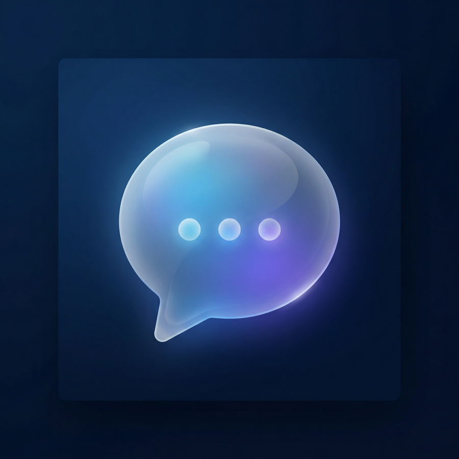

<p align="center">
  
</p>

<h1 align="center">GlassGPT</h1>

<p align="center">
  A premium AI chat client for iOS &amp; iPadOS, built with SwiftUI and Apple's Liquid Glass design language.
</p>

<p align="center">
  <a href="https://ljnpro.github.io/liquid-glass-chat-support/">Support Website</a> · 
  <a href="https://ljnpro.github.io/liquid-glass-chat-support/#changelog">Changelog</a>
</p>

---

## Overview

GlassGPT is a native iOS chat client that connects to the OpenAI API using your own API key. It is designed from the ground up for iOS 26, embracing Apple's Liquid Glass visual language with translucent materials, depth effects, and fluid animations — while remaining fully functional on earlier iOS versions.

The entire chat interface is implemented in **pure SwiftUI** as a native module, delivering smooth 120fps scrolling, native text selection, and platform-consistent interactions that web-based chat UIs cannot match.

## Features

| Category | Details |
|---|---|
| **Models** | GPT-5.4 and GPT-5.4 Pro, both with adjustable reasoning effort |
| **Reasoning Effort** | Configurable per-conversation: Low, Medium, High, XHigh |
| **Markdown Rendering** | Headings, bold, italic, inline code, code blocks with syntax highlighting and copy button |
| **LaTeX Rendering** | Inline math via Unicode fallback, block equations via bundled KaTeX (offline-capable) |
| **Image Support** | Attach photos from library, automatic Base64 encoding for vision-capable models |
| **Streaming** | Real-time token-by-token streaming with thinking/reasoning indicator |
| **Conversation History** | Persistent local storage with search, swipe-to-delete, and chronological grouping |
| **Crash Recovery** | Automatic resend of orphaned drafts after force-quit during API requests |
| **Appearance** | System / Light / Dark theme, haptic feedback (iPhone only) |
| **Security** | API key stored in iOS Keychain, no server-side storage, direct device-to-OpenAI communication |
| **Platform Adaptation** | Dynamic iPad detection (hides haptic toggle), iOS version detection for Liquid Glass badge |

## Architecture

```
GlassGPT/
├── app/                          # Expo Router entry points & tab layout
├── modules/native-chat/
│   └── ios/
│       ├── Models/               # ChatModels, data types, enums
│       ├── Views/
│       │   ├── Chat/             # ChatView, MessageBubble, MessageInputBar, ModelSelectorSheet
│       │   ├── Components/       # MarkdownContentView, CodeBlockView, StreamingTextView
│       │   ├── History/          # HistoryView, conversation list
│       │   ├── Settings/         # SettingsView, SettingsViewModel
│       │   └── Root/             # Tab bar root view
│       ├── Services/             # OpenAIService, KeychainService, HapticService, KaTeXProvider
│       └── Resources/            # Bundled KaTeX JS/CSS/fonts for offline math rendering
├── lib/                          # Shared TypeScript utilities & tests
└── assets/                       # App icons, splash screen, fonts
```

The native Swift module is bridged to the Expo/React Native shell via `expo-modules-core`, allowing the app to leverage Expo's build infrastructure while keeping the entire UI layer in SwiftUI.

## Tech Stack

- **UI Framework**: SwiftUI (iOS 26 Liquid Glass APIs with backward compatibility)
- **App Shell**: Expo SDK 53 + React Native (for build tooling and native module bridging)
- **AI Backend**: OpenAI Chat Completions API (streaming via SSE)
- **Math Rendering**: KaTeX 0.16.11 (bundled offline, WKWebView-based block rendering)
- **Code Highlighting**: Native SwiftUI syntax highlighting with language detection
- **Storage**: iOS Keychain (API key), UserDefaults (preferences), local JSON (conversations)
- **Testing**: Vitest (86 tests covering core logic, LaTeX parsing, response recovery)

## Requirements

- iOS 26.0+ (for Liquid Glass effects) or iOS 17.0+ (graceful degradation)
- Xcode 26+
- An OpenAI API key

## Getting Started

1. **Clone the repository**
   ```bash
   git clone https://github.com/ljnpro/GlassGPT.git
   cd GlassGPT
   ```

2. **Install dependencies**
   ```bash
   pnpm install
   ```

3. **Generate native project**
   ```bash
   npx expo prebuild --platform ios
   ```

4. **Open in Xcode and run**
   ```bash
   open ios/*.xcworkspace
   ```

5. **Enter your OpenAI API key** in Settings within the app.

## Running Tests

```bash
npx vitest run
```

## License

This project is provided as-is for educational and personal use. See [LICENSE](LICENSE) for details.

## Support

For bug reports, feature requests, and FAQs, visit the [GlassGPT Support Website](https://ljnpro.github.io/liquid-glass-chat-support/).
