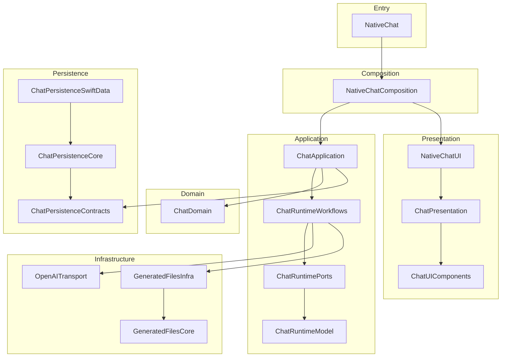

# GlassGPT

[](https://swift.org)
[](https://developer.apple.com)
[](LICENSE)
[](#testing)

A native iOS and iPadOS OpenAI chat client built entirely with Swift, SwiftUI, and SwiftData. No web views, no bridges -- just a fast, private, actor-isolated runtime talking directly to the OpenAI API.

## Features

- **Streaming chat** with real-time token delivery
- **Actor-based runtime** -- `ReplySessionActor` owns all mutable state behind a single isolation boundary
- **16 SPM modules** with clean dependency boundaries and enforced module-boundary CI gates
- **SwiftData persistence** with migration support
- **Generated file handling** -- preview and manage code artifacts from chat responses
- **Adaptive layout** for iPhone and iPad
- **Keychain-secured API key storage** -- no telemetry, no analytics, fully private
- **21 CI gates** covering build, architecture, maintainability, source-share, infra-safety, module-boundary, and release-readiness checks

## Architecture



The composition root (`NativeChatCompositionRoot`) wires all modules. `ChatController` serves as the observable projection facade, delegating to purpose-specific coordinators (conversation, streaming, recovery, lifecycle, send, session, file interaction, generated-file prefetch).

## Requirements

| Tool    | Version  |
|---------|----------|
| Xcode   | 26+      |
| Swift   | 6.2.4    |
| iOS     | 26.0     |
| Python  | 3.14+    |

## Getting Started

```bash
git clone https://github.com/ljnpro/GlassGPT.git
cd GlassGPT
git config core.hooksPath .githooks
open ios/GlassGPT.xcworkspace
```

Build and run the **GlassGPT** scheme on a simulator or device. On first launch, enter your OpenAI API key -- it is stored in the iOS Keychain and never leaves the device.

## Project Structure

```text
GlassGPT/
├── ios/
│   ├── GlassGPT.xcodeproj
│   ├── GlassGPT.xcworkspace
│   └── GlassGPT/
├── modules/native-chat/
│   ├── Package.swift
│   ├── Sources/
│   │   ├── ChatDomain/
│   │   ├── ChatPersistenceContracts/
│   │   ├── ChatPersistenceCore/
│   │   ├── ChatPersistenceSwiftData/
│   │   ├── OpenAITransport/
│   │   ├── GeneratedFilesCore/
│   │   ├── GeneratedFilesInfra/
│   │   ├── ChatRuntimeModel/
│   │   ├── ChatRuntimePorts/
│   │   ├── ChatRuntimeWorkflows/
│   │   ├── ChatApplication/
│   │   ├── ChatPresentation/
│   │   ├── ChatUIComponents/
│   │   ├── NativeChatUI/
│   │   ├── NativeChatComposition/
│   │   └── NativeChat/
│   └── Tests/
├── docs/
└── scripts/
```

## Testing

Run the full CI suite locally:

```bash
./scripts/ci.sh
```

Run a specific gate:

```bash
./scripts/ci.sh maintainability
```

Record snapshot baselines after UI changes:

```bash
./scripts/record_snapshots.sh
```

The CI pipeline enforces 21 gates. All gates must pass before a pull request can merge.

## Contributing

See [CONTRIBUTING.md](CONTRIBUTING.md) for prerequisites, branch strategy, PR workflow, code style, and commit conventions.

## Security

See [SECURITY.md](SECURITY.md) for supported versions, vulnerability reporting, and scope.

## License

GlassGPT is released under the [MIT License](LICENSE).

## Acknowledgments

- [Point-Free](https://www.pointfree.co) -- for SwiftUI and composable architecture inspiration
